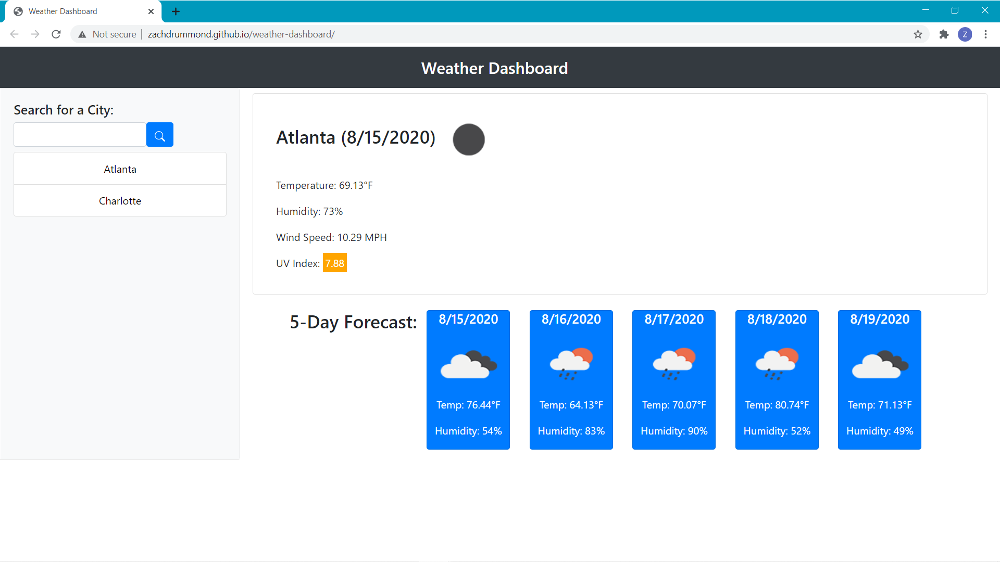

# weather-dashboard

## Table of Contents
* [Description](#Description)
* [Design Elements](#Design-Elements)
* [App Preview](#App-Preview)
* [Links](#Links)
* [Credits](#Credits)

## Description
This is an app that displays a weather dashboard based on data from the OpenWeather API. The user can retrieve the current weather information (temperature, humidity, wind speed, and UV index) for any city in the world, including a 5 day forecast.

### *Usage*
1. Enter a City Name
2. Hit the Search Button
3. Click a Previously Searched City

## Design Elements
### *JavaScript*
* Clean User Interface
* Server-Side API
* Dynamically Updated HTML and CSS powered by jQuery
* Document Object Model Manipulation
* Local Storage
* JSON
* Logical Code Structure
* Sequential Order
* Objects
* Arrays
* Methods
* Global and Local Variables
* Functions
* Event Listeners
* Interval
* if...else Statements
* for Loops
* Comments

### *Bootstrap*
* Grid System
* Navbar
* Cards
* Form
* Sizing
* Spacing

### *HTML*
* Logical Structure
* Sequential Order
* Bootstrap CSS Link
* CSS File Link
* JavaScript File Link
* Concise Descriptive Title
* Semantic Elements
* ids, Classes, and Elements
* Buttons
* Comments

### *CSS*
* Padding
* Font
* Color
* Comments

## App Preview
### *Weather Dashboard*


## Links
* Website: https://zachdrummond.github.io/weather-dashboard/
* GitHub Repository: https://github.com/zachdrummond/weather-dashboard

## Credits
* jquery - https://api.jquery.com/
* Bootstrap: https://getbootstrap.com/

- - -
© 2019 Trilogy Education Services, a 2U, Inc. brand. All Rights Reserved.

# 06 Server-Side APIs: Weather Dashboard

Developers are often tasked with retrieving data from another application's API and using it in the context of their own. Third-party APIs allow developers to access their data and functionality by making requests with specific parameters to a URL. Your challenge is to build a weather dashboard that will run in the browser and feature dynamically updated HTML and CSS.

Use the [OpenWeather API](https://openweathermap.org/api) to retrieve weather data for cities. The documentation includes a section called "How to start" that will provide basic setup and usage instructions. Use `localStorage` to store any persistent data.

## User Story

```
AS A traveler
I WANT to see the weather outlook for multiple cities
SO THAT I can plan a trip accordingly
```

## Acceptance Criteria

```
GIVEN a weather dashboard with form inputs
WHEN I search for a city
THEN I am presented with current and future conditions for that city and that city is added to the search history
WHEN I view current weather conditions for that city
THEN I am presented with the city name, the date, an icon representation of weather conditions, the temperature, the humidity, the wind speed, and the UV index
WHEN I view the UV index
THEN I am presented with a color that indicates whether the conditions are favorable, moderate, or severe
WHEN I view future weather conditions for that city
THEN I am presented with a 5-day forecast that displays the date, an icon representation of weather conditions, the temperature, and the humidity
WHEN I click on a city in the search history
THEN I am again presented with current and future conditions for that city
WHEN I open the weather dashboard
THEN I am presented with the last searched city forecast
```

The following image demonstrates the application functionality:


## Review

You are required to submit the following for review:

* The URL of the deployed application.

* The URL of the GitHub repository. Give the repository a unique name and include a README describing the project.