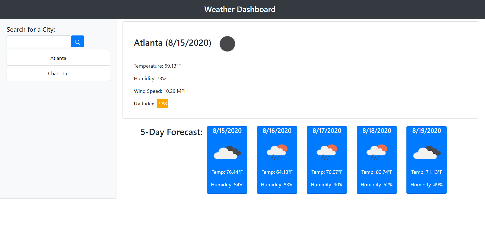

# weather-dashboard

## Table of Contents
* [Description](#Description)
* [Links](#Links)
* [Design Elements](#Design-Elements)
* [App Preview](#App-Preview)
* [Credits](#Credits)

## Description
This is an app that displays a weather dashboard based on data from the OpenWeather API. The user can retrieve the current weather information (temperature, humidity, wind speed, and UV index) for any city in the world, including a 5 day forecast.

### *Usage*
1. Enter a City Name
2. Hit the Search Button
3. Click a Previously Searched City

## Links
* Website: https://zachdrummond.github.io/weather-dashboard/
* GitHub Repository: https://github.com/zachdrummond/weather-dashboard

## Design Elements
* JavaScript
* jQuery
* OpenWeather API
* Local Storage
* HTML
* CSS
* Bootstrap

## App Preview

## Credits
* OpenWeather API - https://openweathermap.org/api
* jquery - https://api.jquery.com/
* Bootstrap: https://getbootstrap.com/